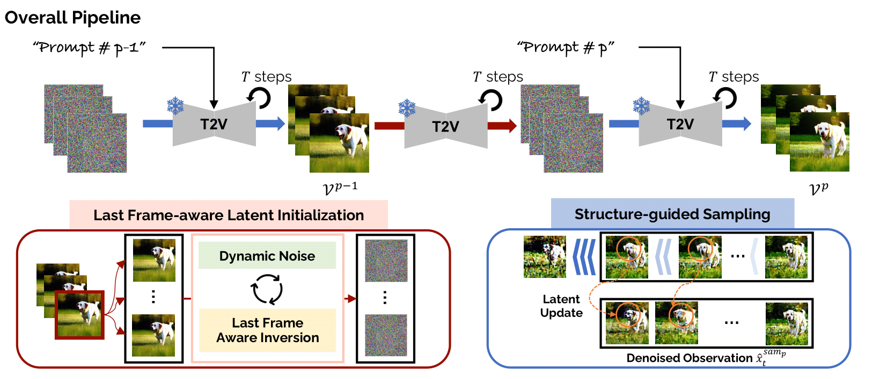

# MEVG: Multi-event Video Generation with Text-to-Video Models

**European Conference on Computer Vision (ECCV) 2024**

Gyeongrok Oh, Jaehwan Jeong, Sieun Kim, Wonmin Byeon, Jinkyu Kim, Sungwoong Kim, Sangpil Kim

  <a  href="https://arxiv.org/abs/2312.04086" rel="nofollow"></a>
  <a href="https://kuai-lab.github.io/eccv2024mevg/" rel="nofollow"></a>
  

This repository is the official implementation associated with the paper "MEVG: Multi-event Video Generation with Text-to-Video Models". 

<a href="https://kuaicv.com/"> </a> 
<a href="https://deepmind.google/"> </a>

**Abstract:** *We introduce a novel diffusion-based video generation method, generating a video showing multiple events given multiple individual sentences from the user. Our method does not require a large-scale video dataset since our method uses a pre-trained diffusion-based text-to-video generative model without a fine-tuning process. Specifically, we propose a last frame-aware diffusion process to preserve visual coherence between consecutive videos where each video consists of different events by initializing the latent and simultaneously adjusting noise in the latent to enhance the motion dynamic in a generated video. Furthermore, we find that the iterative update of latent vectors by referring to all the preceding frames maintains the global appearance across the frames in a video clip. To handle dynamic text input for video generation, we utilize a novel prompt generator that transfers course text messages from the user into the multiple optimal prompts for the text-to-video diffusion model. Extensive experiments and user studies show that our proposed method is superior to other video-generative models in terms of temporal coherency of content and semantics.*




## Setup
This implementation based on LVDM which is a open source for text-to-video generation.

For all the methods described in the paper, is it required to have:
- Anaconda
- Pytorch

Create the conda virtual environment:
```shell script
conda create -n mevg python=3.8.5
conda activate mevg
pip install -r requirements.txt
```

💾 Download text-to-video model

You can download the text-to-video generation model from the official [LVDM](https://github.com/YingqingHe/LVDM).
Once downloaded, please place the model checkpoint in the following directory structure:
```
MEVG/
├── checkpoint/
│   └── <Downloaded_Model.ckpt>
├── ...
```
Make sure the checkpoint file is correctly placed under the checkpoint/ folder to ensure smooth loading during inference.

## Usage
To generate your own video, please use this following code:

```
bash ./shellscripts/sampling.sh
```


---
## Citation

```
@inproceedings{oh2024mevg,
  title={Mevg: Multi-event video generation with text-to-video models},
  author={Oh, Gyeongrok and Jeong, Jaehwan and Kim, Sieun and Byeon, Wonmin and Kim, Jinkyu and Kim, Sungwoong and Kim, Sangpil},
  booktitle={European Conference on Computer Vision},
  pages={401--418},
  year={2024},
  organization={Springer}
}
```

## 🤗 Acknowledgements
We built our code partially based on [LVDM](https://github.com/YingqingHe/LVDM). Thanks the authors for sharing their awesome codebases!
